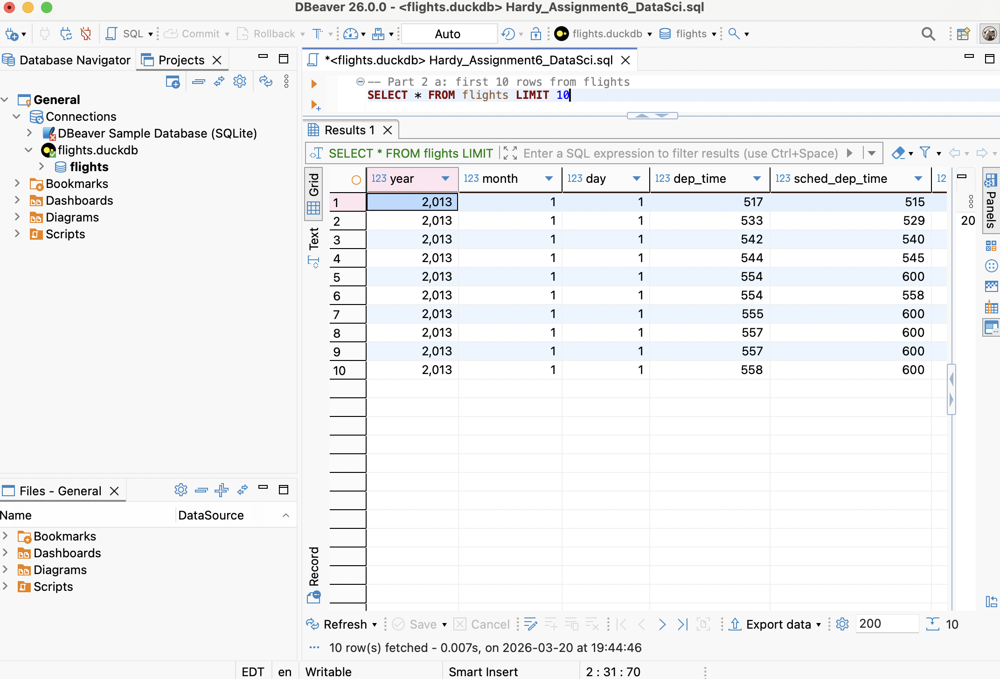
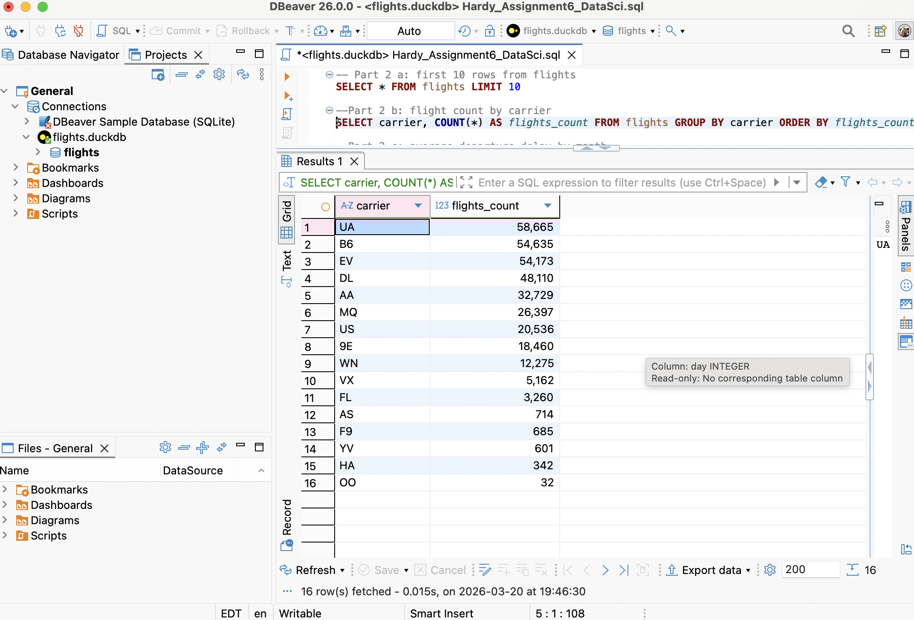
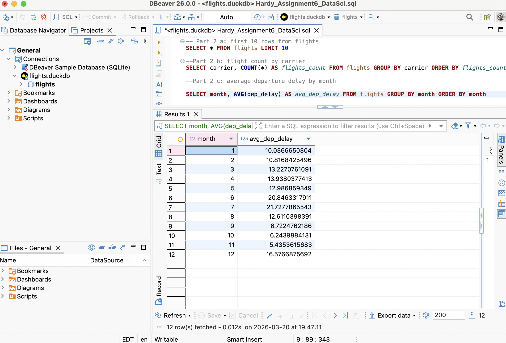
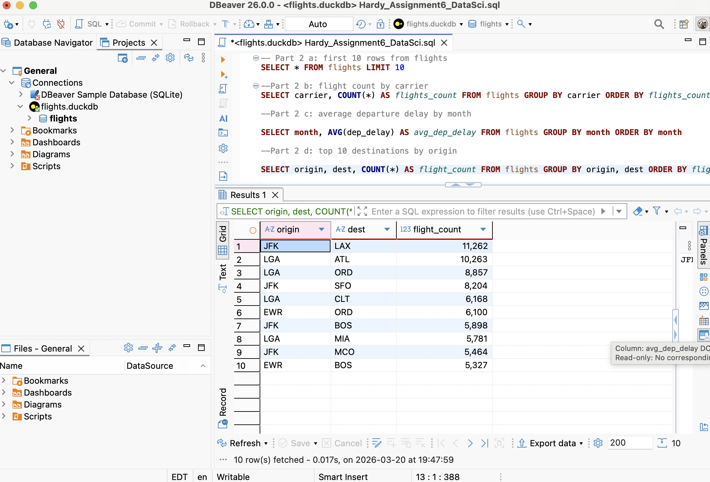

```{r}
#| include: false
#load packages
pacman::p_load(tidyverse, DBI, duckdb, nycflights13)
```

## Part 1

**download files and set up connection**

```{r}
#download the file

url <- "https://data-science-master.github.io/lectures/data/flights.duckdb"

download.file(url, destfile = "/Users/hannahhardy/Documents/Data Science/assignment-6-hannahihardy/flights.duckdb", mode = "wb")

#make connection

conn <- dbConnect(duckdb(), "/Users/hannahhardy/Documents/Data Science/assignment-6-hannahihardy/flights.duckdb")

#check connection

dbIsValid(conn)
```

**Part 1 a: list the first 10 rows of the flights table**

```{r}
table_glimpse <- dbGetQuery(conn, "SELECT * FROM flights LIMIT 10")

print(table_glimpse)
```

**Part 1 b: number of flights in the data set and for each carrier**

```{r}
#count all flights in the dataset

allflights <- dbGetQuery(conn, "SELECT COUNT(*) AS flights_count FROM flights")
print(allflights)


#count flights by carrier 

flightsbycarrier <- dbGetQuery(conn, "SELECT carrier, COUNT(*) AS flights_count FROM flights GROUP BY carrier ORDER BY flights_count DESC")
print(flightsbycarrier)
```

**Part c: average departure delay (dep_delay)**

```{r}
avg_depdelay <- dbGetQuery(conn, "SELECT AVG(dep_delay) AS avg_dep_delay FROM flights")
print(avg_depdelay)
```

**Part d: find the top 5 destinations (dest) with the most flights**

```{r}
five_most_dest <- dbGetQuery(conn, "SELECT dest, COUNT(*) AS dest_count FROM flights GROUP BY dest ORDER BY dest_count DESC LIMIT 5")

print(five_most_dest)
```

**Part e: create a table showing (carrier and average arrival delay (arr_delay))**

```{r}
arrivaldelay <- dbGetQuery(conn, "SELECT carrier, AVG(arr_delay) AS avg_arr_delay FROM flights GROUP BY carrier ORDER BY avg_arr_delay DESC")

print(arrivaldelay)
```

**Close connection**

```{r}
if (dbIsValid(conn)) {
  dbDisconnect(conn)
  cat("Previous connection is closed")
} else {
  cat("No active connection to close")
}
```

## Part 2

**Part a: list first 10 rows from flights**



**Part b: flight count by carrier in descending order**



**Part c: average departure delay by month**



**Part d: top 10 destinations by origin ordered by flight count**


